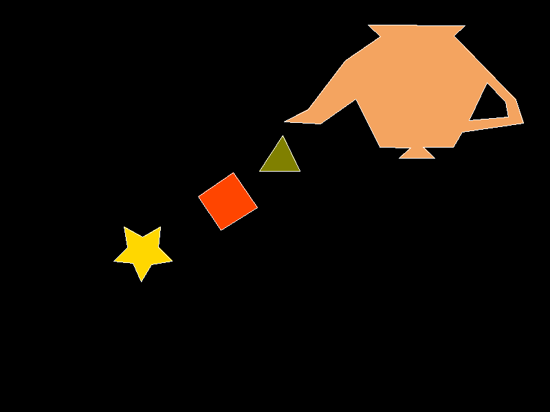

# Lab 1: Filling any polygon

Proyecto en Rust que genera una imagen rasterizada usando `raylib` y un framebuffer propio. El programa dibuja varios polígonos, rellena sus interiores con scanline y exporta el resultado final a `out.bmp`.

## Descripción

Este proyecto implementa rasterización manual de polígonos sobre un framebuffer de 800x600. La imagen final se construye píxel por píxel y luego se guarda como BMP de 24 bits.

## Screenshot

### Output en BMP


## Cómo correr el proyecto

### Requisitos

- [Rust](https://www.rust-lang.org/tools/install) y `cargo`
- Dependencias nativas necesarias por `raylib`
- Un visor de imágenes para abrir `out.bmp`

### Instalación

```bash
git clone https://github.com/MarceloDetlefsen/lab1-graficas.git
cd lab1-graficas
cargo build
```

### Ejecución

```bash
cargo run
```

Al ejecutar el programa se genera `out.bmp` en la raíz del proyecto.

### Build

```bash
cargo build --release
```

## Estructura del proyecto

```text
.
├── Cargo.toml
├── Cargo.lock
├── .gitignore
├── out.bmp                 # Imagen generada por el programa
├── out.png                 # Referencia visual alternativa
└── src/
    ├── main.rs             # Punto de entrada: define polígonos y export la imagen
    ├── framebuffer.rs      # Framebuffer y exportación a BMP
    ├── line.rs             # Dibujo de bordes con Bresenham
    └── fill.rs             # Relleno de polígonos con scanline even-odd
```

## Qué hace el programa

| Parte | Descripción |
|------|-------------|
| `Framebuffer` | Administra la imagen en memoria, permite pintar píxeles y exportar el resultado |
| `line.rs` | Traza los bordes de los polígonos con Bresenham, usando un bloque 3x3 para reducir desfases visuales |
| `fill.rs` | Rellena polígonos con scanline usando la regla `even-odd`, incluyendo casos con agujeros |
| `main.rs` | Declara las figuras, aplica rellenos y dibuja los contornos |

## Polígonos

| Polígono | Descripción |
|----------|-------------|
| Polígono 1 | Figura de 10 vértices con forma de estrella. Se rellena con color dorado y su borde se dibuja en blanco. |
| Polígono 2 | Cuadrilátero inclinado. Se rellena con color naranja y su borde se dibuja en blanco. |
| Polígono 3 | Triángulo simple. Se rellena con color verde oliva y su borde se dibuja en blanco. |
| Polígono 4 | Contorno grande e irregular con una abertura interna. Se rellena con color arena y se maneja junto con el contorno interior para dejar un agujero visible. |

## Algoritmo de relleno

El relleno se hace recorriendo cada fila de la imagen y calculando las intersecciones con los contornos del polígono:

- Se usa muestreo en el centro del píxel para reducir ambigüedades
- Las aristas horizontales se ignoran porque no aportan cruces útiles
- Las intersecciones se ordenan de izquierda a derecha
- Se pintan por pares siguiendo la regla `even-odd`

Eso permite que un contorno interno funcione como agujero si se pasa junto con el contorno exterior en `fill_polygons`.

## Output en BMP

El programa genera directamente `out.bmp` en la raíz del repositorio. El framebuffer implementa exportación manual a BMP 24-bit:

- Escribe el encabezado del archivo BMP
- Escribe el encabezado DIB `BITMAPINFOHEADER`
- Recorre los píxeles de abajo hacia arriba, como espera el formato BMP
- Añade el padding necesario por fila para respetar alineación a 4 bytes

## Repositorio

El repositorio no incluye carpetas de build generadas. El archivo `.gitignore` ignora `target/`, así que el build de Cargo no se versiona.

## Detalles técnicos

- El color de fondo se define al crear el framebuffer
- `render_to_file` detecta la extensión del archivo y exporta BMP cuando corresponde
- El proyecto usa `raylib` solo para manejo de color, vectores y generación de imagen
- La salida principal del programa es una imagen estática, no una ventana interactiva

## Autor

Marcelo Detlefsen - 24554
